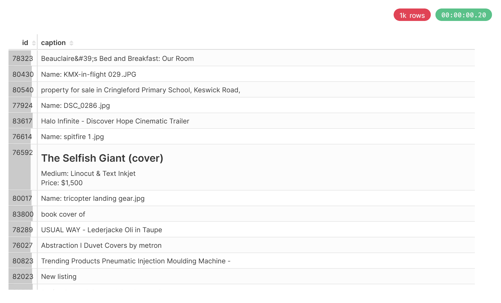

## Table of Contents
- [WSL Installation](#wsl-installation)
- [Install ClickHouse](#install-clickhouse)
- [Data preparation and Import data](#data-preparation-and-import-data)
- [Superset Installation](#superset-installation)
- [ClickHouse Superset Integration](#clickhouse-superset-integration)
- [Project Installation](#project-installation)

## WSL Installation

```bash
wsl --install
```
```bash
wsl -d Ubuntu
```

## Install ClickHouse

### Setup the Debian repository
```bash
# Install prerequisite packages
sudo apt-get install -y apt-transport-https ca-certificates curl gnupg

# Download the ClickHouse GPG key and store it in the keyring
curl -fsSL 'https://packages.clickhouse.com/rpm/lts/repodata/repomd.xml.key' | sudo gpg --dearmor -o /usr/share/keyrings/clickhouse-keyring.gpg

# Get the system architecture
ARCH=$(dpkg --print-architecture)

# Add the ClickHouse repository to apt sources
echo "deb [signed-by=/usr/share/keyrings/clickhouse-keyring.gpg arch=${ARCH}] https://packages.clickhouse.com/deb stable main" | sudo tee /etc/apt/sources.list.d/clickhouse.list

# Update apt package lists
sudo apt-get update
```

### Install ClickHouse server and client
```bash
sudo apt-get install -y clickhouse-server clickhouse-client
```

### Start ClickHouse
```bash
sudo service clickhouse-server start
```

```bash
clickhouse-client
```

## Data preparation and Import data
คู่มือนี้จะแนะนำคุณผ่านขั้นตอนการดาวน์โหลด LAION embeddings และ metadata การประมวลผลข้อมูลให้อยู่ในรูปแบบ CSV และการนำเข้าสู่ ClickHouse 

## การเตรียมข้อมูลและการนำเข้า

### ขั้นตอนที่ 1: สร้างสคริปต์ดาวน์โหลด

สร้างไฟล์ชื่อ `download.sh` พร้อมเนื้อหาดังนี้:

```bash
#!/bin/bash
number=${1}
if [[ $number == '' ]]; then
    number=1
fi

# ดาวน์โหลดไฟล์พร้อมระบบลองใหม่
wget --tries=100 https://deploy.laion.ai/8f83b608504d46bb81708ec86e912220/embeddings/img_emb/img_emb_${number}.npy
wget --tries=100 https://deploy.laion.ai/8f83b608504d46bb81708ec86e912220/embeddings/text_emb/text_emb_${number}.npy
wget --tries=100 https://deploy.laion.ai/8f83b608504d46bb81708ec86e912220/embeddings/metadata/metadata_${number}.parquet

# ประมวลผลไฟล์ที่ดาวน์โหลดมา
python3 process.py $number
```

### ขั้นตอนที่ 2: สร้างสคริปต์ประมวลผล

สร้างไฟล์ชื่อ `process.py`:

```python
import pandas as pd
import numpy as np
import os
import sys

# รับหมายเลขไฟล์จาก command line argument
str_i = str(sys.argv[1])

# กำหนดชื่อไฟล์
npy_file = f"img_emb_{str_i}.npy"
metadata_file = f"metadata_{str_i}.parquet"
text_npy = f"text_emb_{str_i}.npy"

# โหลด embeddings และ metadata
im_emb = np.load(npy_file)
text_emb = np.load(text_npy)
data = pd.read_parquet(metadata_file)

# รวมข้อมูลเป็น DataFrame เดียว
data = pd.concat([
    data, 
    pd.DataFrame({"image_embedding": [*im_emb]}), 
    pd.DataFrame({"text_embedding": [*text_emb]})
], axis=1, copy=False)

# เลือกและเตรียมคอลัมน์
data = data[['url', 'caption', 'NSFW', 'similarity', "image_embedding", "text_embedding"]]

# แปลง embeddings เป็นรูปแบบ list และทำความสะอาด caption text
data['image_embedding'] = data['image_embedding'].apply(lambda x: list(x))
data['text_embedding'] = data['text_embedding'].apply(lambda x: list(x))
data['caption'] = data['caption'].apply(lambda x: x.replace("'", " ").replace('"', " "))

# บันทึกเป็น CSV และลบไฟล์ชั่วคราว
csv_filename = f"{str_i}.csv"
data.to_csv(csv_filename, header=False)
os.system(f"rm {npy_file} {metadata_file} {text_npy}")
```

### ขั้นตอนที่ 3: ให้สิทธิ์การรันสคริปต์

ให้สิทธิ์การรันสคริปต์ดาวน์โหลด:

```bash
chmod +x download.sh
```

### ขั้นตอนที่ 4: ดาวน์โหลดและประมวลผลข้อมูล

รันสคริปต์เพื่อดาวน์โหลดและประมวลผลชุดแรก:

```bash
./download.sh 1
```

> **หมายเหตุ:** คุณสามารถระบุหมายเลขชุดต่าง ๆ ได้โดยการส่งเป็น argument (เช่น `./download.sh 2`, `./download.sh 3` เป็นต้น)

## การตั้งค่า ClickHouse

### ขั้นตอนที่ 1: เชื่อมต่อกับ ClickHouse

เริ่มต้น ClickHouse client:

```bash
clickhouse-client
```

### ขั้นตอนที่ 2: สร้างโครงสร้างตาราง

รัน SQL ต่อไปนี้เพื่อสร้างตาราง LAION:

```sql
CREATE TABLE laion
(
    `id` Int64,
    `url` String,
    `caption` String,
    `NSFW` String,
    `similarity` Float32,
    `image_embedding` String,  
    `text_embedding` String    
)
ENGINE = MergeTree
ORDER BY id
SETTINGS index_granularity = 8192;
```

### ขั้นตอนที่ 3: นำเข้าข้อมูล CSV

นำเข้าไฟล์ CSV ที่ประมวลผลแล้วเข้าสู่ตาราง:

```sql
INSERT INTO laion FROM INFILE '/path/to/your/csv/files/*.csv';
```

> **สำคัญ:** เปลี่ยน `/path/to/your/csv/files/` เป็นเส้นทางจริงที่เก็บไฟล์ CSV ของคุณ

##  โครงสร้างไฟล์

หลังจากรันสคริปต์แล้ว ไดเร็กทอรีของคุณควรมี:

```
├── download.sh          # สคริปต์ดาวน์โหลด
├── process.py           # สคริปต์ประมวลผล
└── 1.csv               # ไฟล์ CSV ที่ประมวลผลแล้ว
```

## Superset Installation

### Get Superset

```bash
git clone https://github.com/apache/superset
```

### Start the latest official release of Superset
```bash
# Enter the repository you just cloned
$ cd superset

# Set the repo to the state associated with the latest official version
$ git checkout tags/5.0.0

# Fire up Superset using Docker Compose
$ docker compose -f docker-compose-image-tag.yml up
```

### Log into Superset
ตอนนี้ไปที่ http://localhost:8088 และเข้าสู่ระบบด้วยบัญชีที่สร้างขึ้นตามค่าเริ่มต้น
```bash
username: admin
password: admin
```

# ClickHouse Superset Integration

คู่มือการเชื่อมต่อ ClickHouse database กับ Apache Superset สำหรับการสร้างการวิเคราะห์และการแสดงผลข้อมูลแบบ interactive

### 1. **เชื่อมต่อกับ Superset Container**

เปิด terminal:

```bash
docker exec -it superset_app bash
```

### 2. **ติดตั้ง ClickHouse Python Client**

ภายใน terminal ให้ติดตั้ง ClickHouse Python client:

```bash
pip install clickhouse-connect
```

### 3. **เข้าสู่ระบบ Superset**

ไปที่ `http://localhost:8088` และเข้าสู่ระบบด้วยข้อมูลดังนี้:

```
username: admin
password: admin
```

### 4. **เพิ่มการเชื่อมต่อกับ ClickHouse**

หลังจากเข้าสู่ระบบใน Superset:

- คลิกที่เครื่องหมาย **+** มุมขวาบน

- เลือก **Data** แล้วเลือก **Connect database**
- เลือก **ClickHouse Connect** ในส่วนของ **Supported databases**

**กรอกข้อมูลการเชื่อมต่อ:**

| ฟิลด์ | ค่า | คำอธิบาย |
|-------|-----|----------|
| **Host** | `localhost` | Host ของ ClickHouse (หรือ IP ของเซิร์ฟเวอร์) |
| **Port** | `8123` | พอร์ตสำหรับ HTTP (หรือ `9000` สำหรับ TCP) |
| **Username** | `default` | Username ที่ใช้งานบน ClickHouse |
| **Password** | *(ว่าง)* | Password ของ ClickHouse |
| **Database** | `default` | ชื่อ database ที่ต้องการเชื่อมต่อ |

หลังจากกรอกข้อมูลเสร็จแล้ว:
- คลิก **CONNECT**
- จากนั้นคลิก **FINISH** เพื่อบันทึกการเชื่อมต่อ

**เพิ่ม Dataset จาก ClickHouse**

- ไปที่ **Datasets** ใน Superset
- คลิก **+ Dataset** ที่มุมขวาบน
- กำหนดค่าต่างๆ:
   - **Database**: ClickHouse Connect (Superset)
   - **Schema**: `default`
   - **Table**: `laion` (หรือชื่อตารางที่ต้องการ)
- คลิก **Create Dataset** เพื่อนำเข้าข้อมูลจากตารางใน ClickHouse

**สร้าง Chart**

- หลังจากเพิ่ม Dataset แล้ว คลิก **Create new chart**
- เลือก **Table** เป็นประเภทของ Chart ที่ต้องการ
- กำหนดการตั้งค่า:
   - **Query mode**: Raw records
   - **Columns**: เลือกคอลัมน์ที่ต้องการ เช่น `id`, `caption`, `similarity`
   - **Ordering**: ตั้งการเรียงลำดับ เช่น `similarity [asc]`
- คลิก **Create chart** เพื่อสร้างกราฟที่ต้องการ


**ผลลัพธ์ที่ได้**

เมื่อสร้างกราฟเสร็จแล้ว คุณจะเห็น:



## Project Installation

git clone https://github.com/0xOat/HomeWork_2.git

```bash
cd HomeWork_2
```
```bash
pip install -r requirements.txt
```
```bash
python manage.py runserver
```

เมื่อเสร็จสิ้นการตั้งค่าและการสร้างกราฟ คุณจะสามารถแสดงข้อมูลจาก ClickHouse ใน Superset ได้ พร้อมกับการวิเคราะห์ข้อมูลในรูปแบบ interactive ผ่าน Superset dashboard.